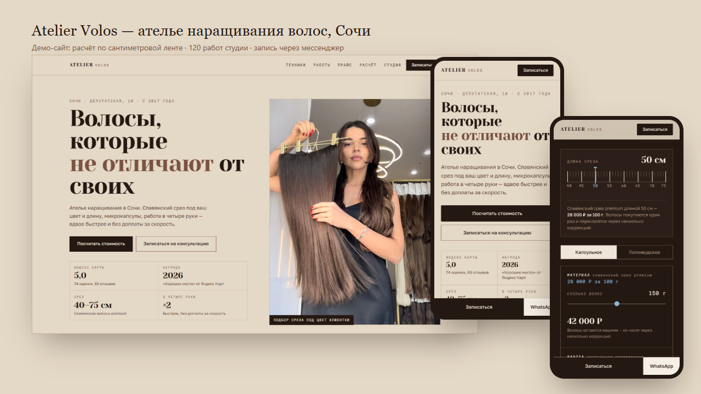

# Atelier Volos — сайт ателье наращивания волос в Сочи

**Живой сайт → [bmxer32.github.io/atelier-volos-demo](https://bmxer32.github.io/atelier-volos-demo/)**



Студия на Депутатской, 10 — рейтинг 5,0 на Яндекс Картах, 69 отзывов,
награда «Хорошее место 2026». Своего сайта нет: только карточка в Яндекс Бизнесе
и запись через WhatsApp и Telegram.

Весь контент собственный — 129 фотографий студии, 40 позиций прайса,
отзывы дословно. Ничего сгенерированного и ничего стокового.

### Что интересного внутри

**Наряд-заказ сразу после прайса.** В наращивании две суммы, и до визита клиентка
не знает ни одной: волосы продаются за 100 г с ценой по длине среза (40 см — 25 000 ₽,
75 см — 36 000 ₽), а работа считается по прядям (65 ₽ у мастера, 85 ₽ у топ-мастера).
«65 рублей» звучит дёшево ровно до того момента, когда выясняется, что прядей нужно
полторы сотни, а волосы стоят как половина зарплаты. Поэтому расчёт стоит прямо под
прайсом: человек читает цены в прядях и граммах — и тут же видит, во что это складывается.

Сайт считает обе суммы отдельно и складывает. Длина выбирается сантиметровой лентой
с настоящей разметкой — это инструмент из их же ремесла и главный визуальный акцент
страницы. Для голливудской техники расчёт переключается на трессы с их плоскими ценами.
Время процедуры берётся из собственного заявления студии: 150–200 прядей в час в четыре руки.

**Расчёт уходит в мессенджер одним нажатием.** Кнопка открывает WhatsApp с уже
написанным сообщением: длина, граммы, пряди, категория мастера и получившаяся сумма.
Ровно то письмо, которое клиентка хочет отправить, но не может составить сама.
Telegram по номеру не принимает готовый текст — там сообщение кладётся в буфер обмена.

**Честность вместо счёта.** Нигде не написано «ваша цена». Написано, что это арифметика
по опубликованному прайсу, а сколько грамм и прядей нужно именно вам — считает мастер
на бесплатной консультации. Ни одна цифра не выдумана.

**Галерея на 120 кадров** с фильтрами по разделам (работы, волосы, процесс, студия, уход),
лайтбоксом и ленивой загрузкой. Категории проставлены вручную по просмотру каждого кадра.

**Мобильный формат первичный** — трафик приходит с Яндекс Карт с телефона.
Липкая панель записи внизу экрана, все зоны нажатия от 50 px.

Без сборки и зависимостей: ванильные HTML/CSS/JS. Внешние запросы — только
Google Fonts и виджет карты Яндекса.

---

## Что где

| Файл | Что это |
|---|---|
| `index.html` | сам сайт |
| `assets/css/style.css` | стили |
| `assets/js/data.js` | **все данные студии** — прайс, отзывы, длины, категории фото |
| `assets/js/app.js` | логика: лента, расчёт, галерея, лайтбокс, форма записи |
| `assets/photo/*.webp` | 129 фото в двух размерах (620 и 1280 px) — то, что грузит сайт |
| `assets/img/*.jpg` | оригиналы фото в исходном разрешении (в прод не нужны, 51 МБ) |

Правки контента делаются в `assets/js/data.js`, вёрстку трогать не нужно.

## Откуда данные

Ничего не выдумано и не сгенерировано:

* **Фото** — 129 шт., выкачаны из карточки студии на Яндекс Картах
  (`avatars.mds.yandex.net/get-altay/...`, размер `orig`). Категории проставлены
  вручную по просмотру каждого кадра на контактных листах.
* **Прайс** — 40 позиций из вкладки «Товары и услуги» на Яндекс Картах
  и каталога `atelier-volos.clients.site`. Формулировки и диапазоны сохранены как есть.
* **Отзывы** — 12 штук дословно с Яндекс Карт (5,0 · 74 оценки · 69 отзывов),
  аспекты (персонал 94%, атмосфера 100%, окрашивание 93%) — оттуда же.
* **Мастера** — имена собраны из текстов отзывов клиенток: Инесса, Влада, Марина,
  Юлия, Алёна, Анастасия, Софья, Алина. Роли восстановлены по контексту — **проверить у студии**.
* **Реквизиты** — ИП Курохтина Марина Валерьевна, из подвала их страницы в Яндекс Бизнесе.
* **Тексты о студии** — пересказ их собственного описания, короче и без канцелярита.

## Запись

У студии нет YCLIENTS или другого виджета, который можно встроить: онлайн-запись
работает внутри Яндекс Карт. Поэтому на сайте два пути, и оба ведут туда, где студия
реально отвечает:

1. **Форма** собирает имя, услугу, удобное время и расчёт → открывает WhatsApp
   или Telegram с готовым текстом. Ничего не отправляется без нажатия пользователя,
   бэкенд не нужен.
2. **Ссылка на расписание** — кнопка «Записаться онлайн» в карточке Яндекса.

Если студия заведёт YCLIENTS, виджет встраивается в модалку одним блоком —
как сделано в соседнем проекте `koko-studio-demo`.

## Что нужно уточнить у студии

1. **Уход Tokio Inkarami опубликован дважды** с разными вилками: 8 500–10 500 ₽
   и «короткие 8 500–11 500, длинные 11 500–13 500». Сейчас на сайте обе строки —
   нужно оставить одну.
2. **График работы** — на карточке только «до 20:00», по дням недели нигде нет.
   Сейчас написано «Ежедневно до 20:00».
3. **Мастера** — список собран из отзывов. Нужны настоящие имена, специализации,
   а лучше фото: блок в `data.js`, поле `masters`.
4. **Telegram-канал с коллекцией детских срезов** упомянут в прайсе, но ссылки нет.
5. **Маникюр** — в прайсе только две позиции, хотя в отзывах его хвалят постоянно
   и мастеров трое. Похоже, прайс неполный.
6. **Акция «в четыре руки»** действует до 31.10.2026 — после этой даты
   поправить `methods[2]` и `promos` в `data.js`.
7. **Год основания** — «с 2017» взят из ОГРНИП и вывески «since 2017» на фото. Подтвердить.

## Технические заметки

* Мобильный формат первичный, десктоп — расширение. Внизу экрана липкая панель записи.
* Содержимое ограничено 1200 px (галерея — 1520 px) через `--gutter`: поле секции растёт
  вместе с экраном, поэтому на широком мониторе строки не расползаются, а тёмные полосы
  остаются во всю ширину. Фото первого экрана дополнительно не выше `100vh - 168px`.
* Изображения — webp, 258 файлов на 19 МБ; в первый экран сетки грузится 16 карточек,
  остальные по кнопке «показать ещё» + `loading="lazy"`.
* **Разрешение исходников очень разное** — от 533×800 до 4284×5712. В крупные слоты
  (герой, карточки техник, широкое фото студии) берутся только кадры от 1080 px по ширине;
  список размеров лежит в `photo_dims.json`. При замене фото это стоит проверить.
* У `` с атрибутами `width`/`height` в CSS обязателен `height: auto` — иначе атрибут
  превращается в `height: 2216px` и отменяет `aspect-ratio`, фото растягивается на экран.
* Шрифты: Yeseva One (заголовки), Golos Text (текст), Martian Mono (цифры и метки) —
  все с кириллицей.
* Палитра снята с витрины срезов: лён, пшеница, каштан, горький шоколад. Единственный
  не-волосяной цвет — синий мел закройщика, им отмечены все числа и всё нажимаемое.
* Доступность: фокус с клавиатуры, `prefers-reduced-motion`, alt у всех фото,
  один h1, `scroll-margin` под липкой шапкой.

## Локально и проверки

```
node serve.mjs     # http://localhost:8788
node qa.mjs        # 41 проверка: расчёт, галерея, лайтбокс, форма, битые фото
node shot.mjs      # скриншоты мобильного и десктопа по секциям
```

`qa.mjs` считает суммы независимо от сайта и сверяет их с тем, что показано на экране,
поэтому ошибка в прайсе или в формуле не проедет незамеченной.

## Служебные скрипты (в прод не нужны)

`scrape_overview.mjs`, `scrape_services.mjs`, `scrape_reviews.mjs`, `scrape_photos.mjs`,
`scrape_site.mjs`, `scrape_booking.mjs`, `scrape_bookapi.mjs` — сбор данных;
`download_photos.mjs`, `optimize.mjs` — фото; `contactsheet.mjs` — контактные листы
для разбора кадров; `maptest.mjs` — подбор виджета карты; `preview.mjs` — обложка.
